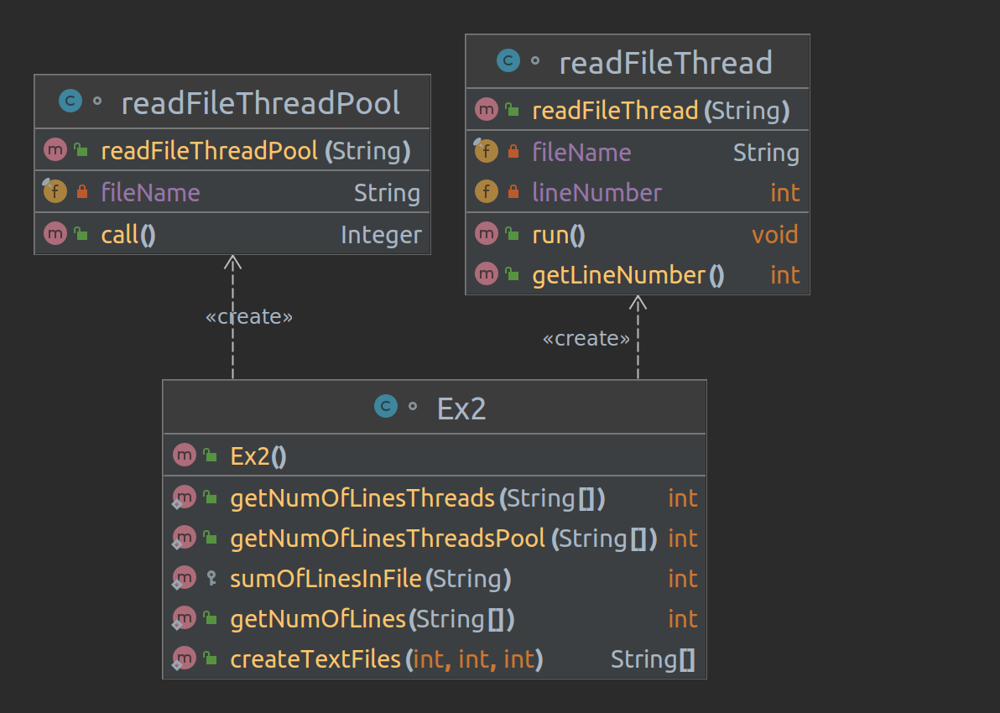

# EX2_1

## 1 createTextFiles

We create in loop n files that the names that we gave them is file_i to i from 1 to n.
For all file that we created we will write a random number of line into it.
The function return array that contain the names of the files.


## 2 getNumOfLines

Getting array of names of files and return the sum of lines in all the files.
For doing this we creat new function called "sumOfLinesInFile" this function sums up the number of line in 1 file.
We will activate the "sumOfLinesInFile" on each file. And this way we will sum all the lines in all the files. 


## 3 getNumOfLinesThreads

Getting array of names of files and return the sum of lines in all the files,
but now we will do it using threads.The sum of lines in each file will be executed in a single thread.
We create stack of threads and in lop we create thread and put him in the stack and let's start it.
After that in a loop we will activate join on thread and when he will finish we will add the sum of its lines to the total.


## 4 getNumOfLinesThreadPool

Getting array of names of files and return the sum of lines in all the files,
but now we will do it using threadpool.
We create a threadpool abd for each file we sum up in "readFileThreadPool" that  implements Callable.
All the future we will enter to array.
After that in a loop we activate for each of the future "get" and sum up the results.


## 5 Comparsion of times

We will run that the values are "number of files-1000 ,seed-10 ,bound-1000"
We see that the ThreadsPool does in the shortest time after him the Tread and at the end the normal fonction.

```output
number of files-1000
seed-10
bound-1000

###########getNumOfLines###########
Number of lines :508010
Time in Millis:1186
Time in Seconds:1.186

###########getNumOfLinesThreads###########
Number of lines :508010
Time in Millis:604
Time in Seconds:0.604

###########getNumOfLinesThreadsPool###########
Number of lines :508010
Time in Millis:378
Time in Seconds:0.378

```
We will run again that the values are "number of files-10 ,seed-10 ,bound-10"
We see that the tread and the ThreadsPool are similar.We ses that when there are less files and lines there is almost no diffrence between them.

```output

number of files-10
seed-10
bound-10

###########getNumOfLines###########
Number of lines :38
Time in Millis:18
Time in Seconds:0.018

###########getNumOfLinesThreads###########
Number of lines :38
Time in Millis:10
Time in Seconds:0.01

###########getNumOfLinesThreadsPool###########
Number of lines :38
Time in Millis:10
Time in Seconds:0.01
```

## UML
