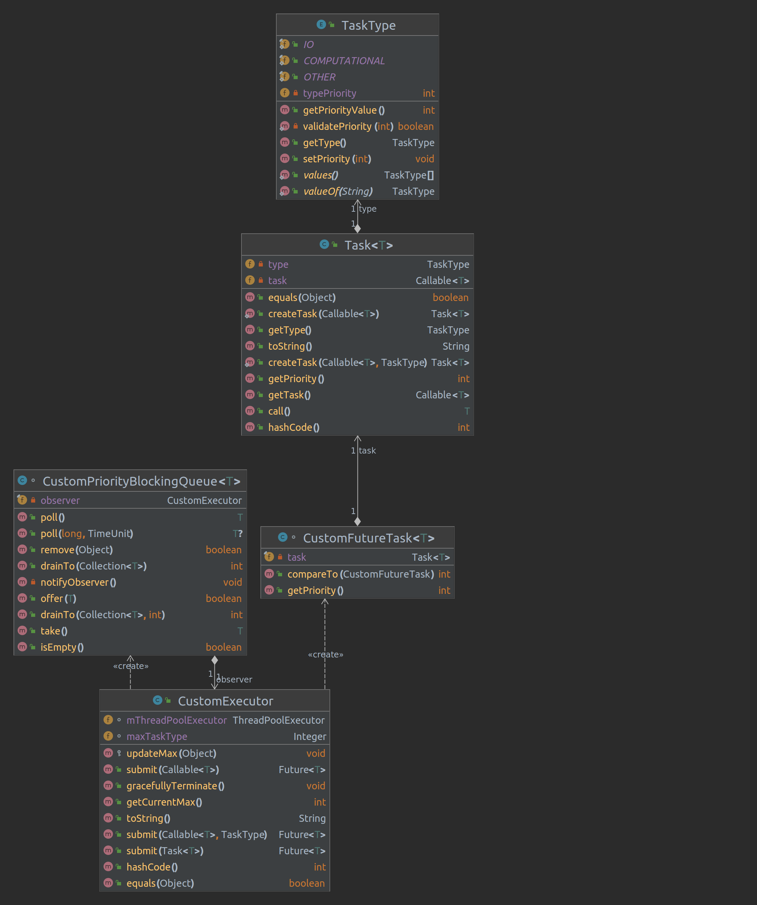

# EX2_2
This part of exercise is about try to make thread-poll that submit customs callable with priority.
this function is not native to java, so we need to use OOD to program it properly.

## Problems and solutions
The main problem is that submit callable with priority to thread-poll is not native to java.
so we need to "go around".
To solve the problem we need our own callable, so we create [Task](Task.java),
that implement Callable. because of that we can submit our task to thread-poll.
but if we submit our task the thread-poll get FutureTask and that is what enter the queue.
because we use priority queue we try to sort base in natural order so the queue try to find the compareTo
of FutureTask, and it failed, so we build our own [CustomFutureTask](CustomFutureTask.java).
in that way can add our own compareTo. the exercise also ask to get the currently max priority task in queue,
so we need to track its value on every change to the queue.
so we create our own [CustomPriorityBlockingQueue](CustomPriorityBlockingQueue.java) that override evey change and notify,
the current max. (kind of observer)
## UML
